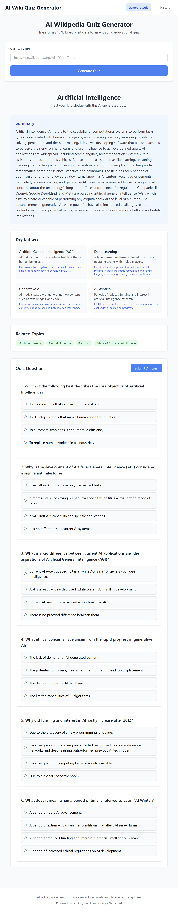
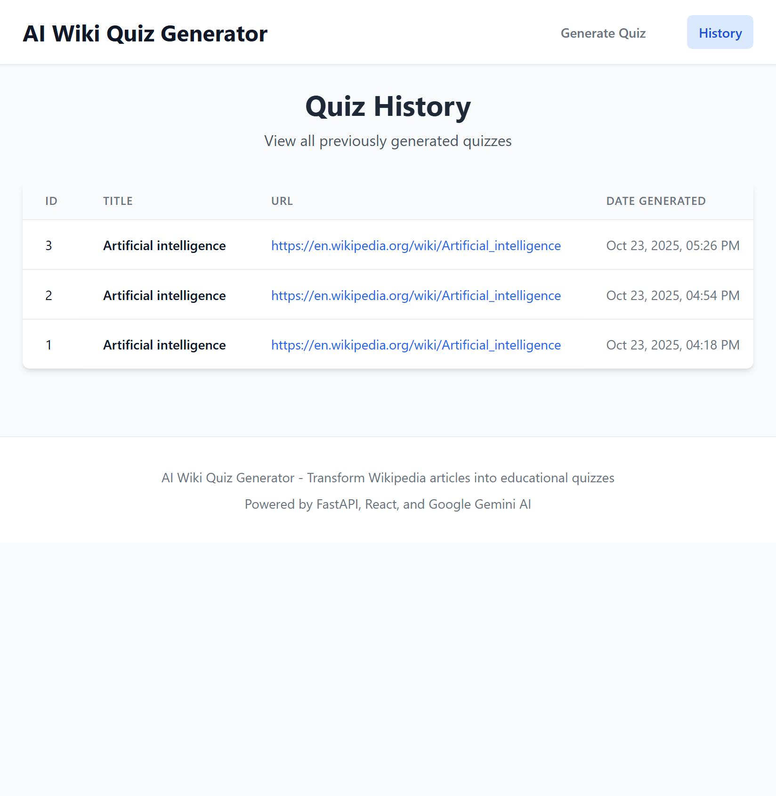

# 🌐 Live Deployment

**Frontend:** [https://ai-wiki-quiz-generator-frontend.vercel.app/](https://ai-wiki-quiz-generator-frontend.vercel.app/)

**Backend:** [https://ai-wiki-quiz-generator-backend.onrender.com/](https://ai-wiki-quiz-generator-backend.onrender.com/)

---

# 🧠 AI Wiki Quiz Generator - Frontend

A modern React application that transforms Wikipedia articles into interactive educational quizzes using AI.

## 🎯 Features

- **📝 Quiz Generation**: Convert Wikipedia URLs into quizzes
- **🎯 Interactive Learning**: Multiple-choice questions with scoring
- **📚 Quiz History**: Track and revisit previous quizzes
- **📱 Responsive**: Works on desktop and mobile
- **⚡ Real-time Feedback**: Instant results and explanations

---

## 🛠️ Tech Stack

- React 18 + Vite
- Tailwind CSS
- Fetch API
- Deploy-ready for Vercel/Netlify

---

## 📸 Screenshots

### 🏠 Home Interface


_Main interface with tabs_

### 📝 Quiz Generation


_Generate quiz from Wikipedia URL_

### 📚 Quiz History


_Track all generated quizzes_

---

## 🚀 Quick Start

### Installation

```bash
git clone <your-repo>
cd frontend
npm install
echo "VITE_API_URL=http://localhost:8000" > .env
npm run dev
```

### Environment Variables

```env
VITE_API_URL=http://localhost:8000  # or your deployed backend
```

---

## 🎯 Usage Examples

### Example 1: Science Quiz

**URL:** `https://en.wikipedia.org/wiki/Quantum_mechanics`
Generates 5–8 questions about quantum theory (Schrödinger, Heisenberg, superposition, uncertainty principle)

### Example 2: History Quiz

**URL:** `https://en.wikipedia.org/wiki/Renaissance`
Covers art, science, culture, and figures like Da Vinci & Michelangelo

### Example 3: Technology Quiz

**URL:** `https://en.wikipedia.org/wiki/Artificial_intelligence`
Covers ML concepts, neural networks, NLP, and ethics

---

## 📁 Project Structure

```
frontend/
├── src/
│   ├── components/QuizDisplay.jsx
│   ├── services/api.js
│   ├── tabs/
│   │   ├── GenerateQuizTab.jsx
│   │   └── HistoryTab.jsx
│   └── App.jsx
├── package.json
└── vite.config.js
```

---

## 🚀 Deployment

### Vercel (Recommended)

1. Push to GitHub
2. Connect repo to [Vercel](https://vercel.com)
3. Set `VITE_API_URL` environment variable
4. Deploy!

### Netlify

```bash
npm run build
# Drag 'dist' folder to Netlify
```

---

## 🎯 API Examples

### Generate Quiz

```javascript
const quiz = await apiService.generateQuiz(
  "https://en.wikipedia.org/wiki/Photosynthesis"
);
```

### Sample Response

```json
{
  "title": "Photosynthesis",
  "summary": "Process plants use to convert light energy...",
  "questions": [
    {
      "question": "What is the primary purpose of photosynthesis?",
      "options": ["A", "B", "C", "D"],
      "correct_answer": "B",
      "explanation": "Converts light energy to chemical energy"
    }
  ]
}
```

---

## 🔧 Development

```bash
npm run dev          # Development
npm run build        # Production build
npm run preview      # Preview build
```

---

## 📞 Support

- Check browser console for errors
- Verify API URL configuration
- Test with example Wikipedia URLs

---

**Transform any Wikipedia article into an engaging learning experience!** 🚀

screenshot is not show in github why?
